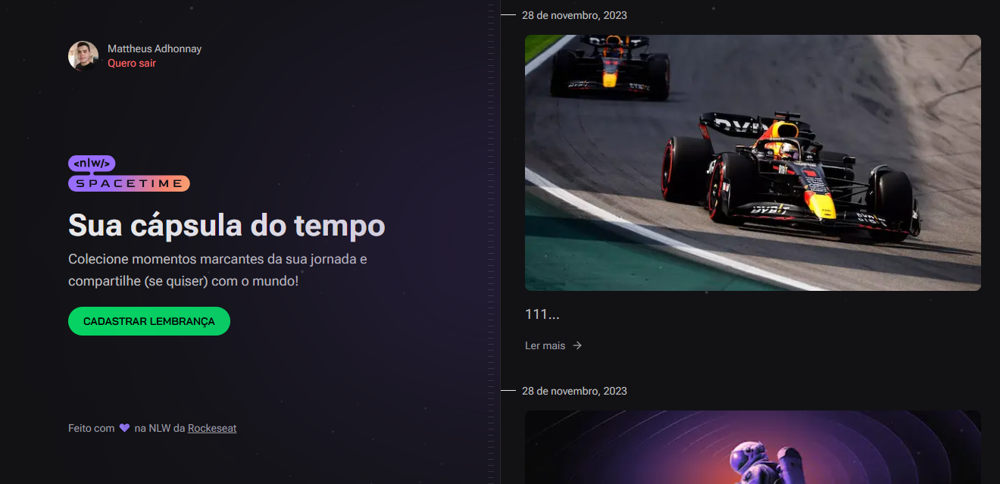

<h1 align="center"> NLW SpaceTime - Cápsula do Tempo </h1>

NLW é um evento exclusivo e gratuito, promovido pela Rocketseat para ensino de tecnologias WEB.  

  <a href="#-tecnologias">Tecnologias</a>&nbsp;&nbsp;&nbsp;|&nbsp;&nbsp;&nbsp;
  <a href="#-projeto">Projeto</a>&nbsp;&nbsp;&nbsp;|&nbsp;&nbsp;&nbsp;
  <a href="#-instalação">Projeto</a>&nbsp;&nbsp;&nbsp;|&nbsp;&nbsp;&nbsp;

 

  

## 🚀 Tecnologias

Esse projeto foi desenvolvido com as seguintes tecnologias:

- Next JS
- Prisma
- Node
- JavaScript
- Git e Github
- Figma

## 💻 Projeto

A cápsula do tempo é uma aplicação fullstack para registar momentos. É possível fazer o login através do github.

## 💻 Instalação e execução

Faça o download do repositório. Ao abrir no vs code, instale: npm install.
Em seguida configure as suas variáveis de ambiente no arquivo: .env
Após isso, executa a aplicação no serve e web: npm run ndev